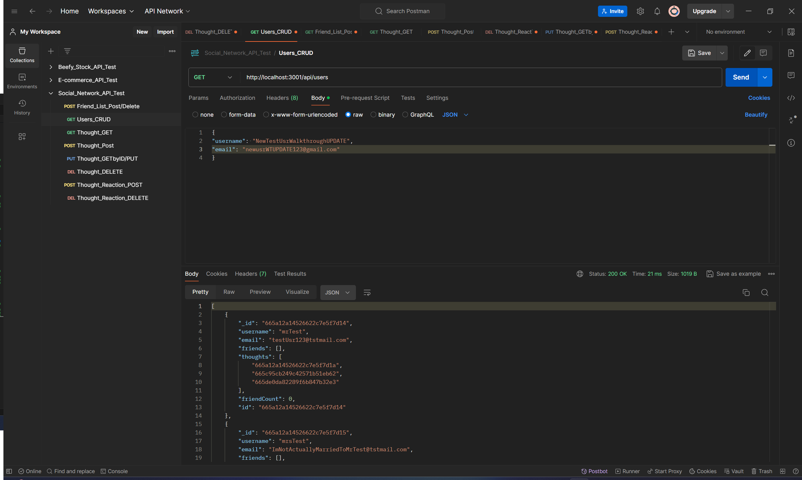

# Social-network-api

## Description
I created this application to gain experience with MongoDB databases. During this project I defined models and API routes. My biggest challenge was defining the reaction api requests as it was my first time using a schema only as opposed to a model. I had to further my understanding of subdocuments before I finished off the project. 

## Installation
You can clone my repo by using the green code button at the top of this page. 
Alternatively, you can watch my walkthrough for a short video on the functionality of my app here: [https://youtu.be/5A6rpt3KXXM](https://youtu.be/UFquVC3-W_c)

## Usage
Once you have the command line open use npm i to install the neccesary node modules and from there type the command "npm run start" and you will be greeted with the message to show the app is running as shown below

From there you can use Postman to test the api endpoints as shown below:

## Credits
n/a

## License
n/a

## Contributing
n/a

## Tests
n/a

## Questions
for any questions you can reach me at: leewheeler123@gmail.com 

or visit my github profile: github.com/LWSE13
